<!-- hero: monochrome ASCII portrait alongside 3D ASCII wordmark -->
<h3><code>SmartKidzee@github ~ $ whoami</code></h3>

<table>
<tr>
<td valign="top"></td>
<td valign="top"></td>
</tr>
</table>

 
 

<!-- stats section -->
<h3><code>SmartKidzee@github ~ $ ./stats.sh</code></h3>

  

  

 
 

<!-- animated contribution graph -->
<h3><code>SmartKidzee@github ~ $ ./contributions.sh</code></h3>

<picture>
  <source media="(prefers-color-scheme: dark)" srcset="https://github.com/SmartKidzee/SmartKidzee/blob/output/github-contribution-grid-snake-dark.svg" />
  <source media="(prefers-color-scheme: light)" srcset="https://github.com/SmartKidzee/SmartKidzee/blob/output/github-contribution-grid-snake.svg" />
  
</picture>

 
 

<h3><code>SmartKidzee@github ~ $ ./links.sh</code></h3>

<b>Gen AI Student Developer · AI Systems Builder · Junior CS (AI & ML) @ NIE Mysuru</b>

  

 
 

<h3><code>SmartKidzee@github ~ $ ./activity.sh</code></h3>

 
 

<h3><code>SmartKidzee@github ~ $ ./leetcode.sh</code></h3>

 

---

### also check out my **other** github — where the meme-coded but real projects live

*the chaotic side of the lab. actual projects, less polish, more soul.*

---

