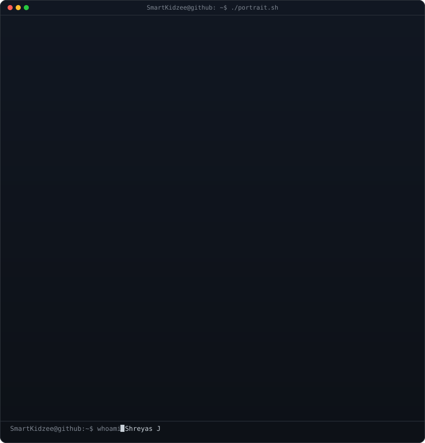
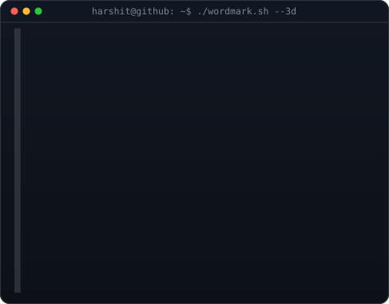

<!-- Animated Twinkling Header Wave -->

  

<!-- Identity Header Animation -->

  

<!-- Dynamic Subtitle Terminal -->

  

 

<!-- ==================== 01 : IDENTITY & RADAR ==================== -->

  

<table>
  <tr>
    <td valign="top"></td>
    <td valign="top"></td>
  </tr>
</table>

  <b>Gen AI Student Developer · AI Systems Builder · Junior CS (AI &amp; ML) @ NIE Mysuru</b>

 

<!-- ==================== 02 : TECHNICAL ARSENAL ==================== -->

  

<!-- Live Animated Stack Cycling Ticker -->

  

  

<!-- Verified Badges -->

  
  
   
  
  

 

<!-- ==================== 03 : NETWORK & CHANNELS ==================== -->

  

  
  
  
   
  
  
  

  

 

<!-- ==================== 04 : TELEMETRY & REPOS ==================== -->

  

<!-- Working Custom Vercel Stats -->

  
  

<!-- Animated Streak -->

  

 

<!-- ==================== 05 : COMMIT VELOCITY & SNAKE ==================== -->

  

  <picture>
    <source media="(prefers-color-scheme: dark)" srcset="https://raw.githubusercontent.com/SmartKidzee/SmartKidzee/output/github-contribution-grid-snake-dark.svg" />
    <source media="(prefers-color-scheme: light)" srcset="https://raw.githubusercontent.com/SmartKidzee/SmartKidzee/output/github-contribution-grid-snake.svg" />
    
  </picture>

 

<!-- ==================== 06 : ALGORITHMIC COMBAT ==================== -->

  

  

 

<!-- ==================== 07 : THE EXPERIMENTAL LAB ==================== -->

  

  

  <i>The chaotic side of the lab. Real projects, less polish, more soul.</i>

 

<!-- Animated Twinkling Footer Wave -->

  

